# Data Flow & State Diagrams — Rust Implementation

> Mind-map style walkthroughs of every user-facing flow in the codebase, from *"the user does X"* through each branch to the final outcome, plus state machines. These diagrams mirror the actual Rust code (`services/*`, `crates/*`). Render with any Mermaid viewer (GitHub, VS Code, mermaid.live).

Legend: `([...])` terminal · `[...]` process · `{...}` decision · dashed = optional/error path.

---

## 1. Auth & Identity

### 1.1 Register
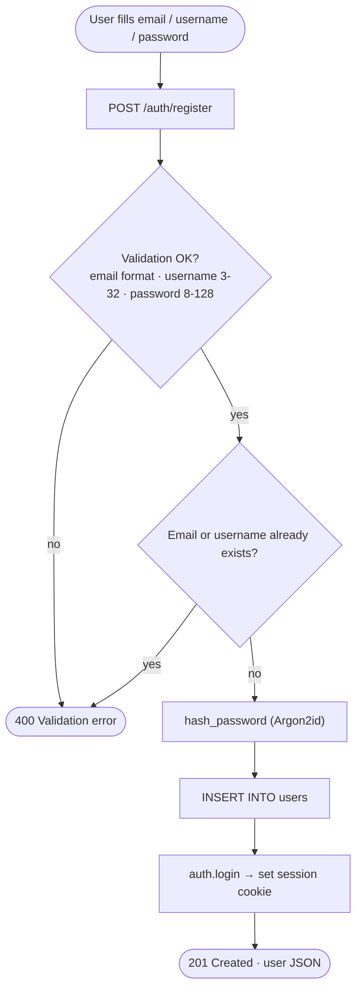
```mermaid
flowchart TD
    A([User fills email / username / password]) --> B["POST /auth/register"]
    B --> C{Validation OK?<br/>email format · username 3-32 · password 8-128}
    C -- no --> D([400 Validation error])
    C -- yes --> E{Email or username already exists?}
    E -- yes --> D
    E -- no --> F["hash_password (Argon2id)"]
    F --> G["INSERT INTO users"]
    G --> H["auth.login → set session cookie"]
    H --> I([201 Created · user JSON])
```

### 1.2 Login (with brute-force lockout)
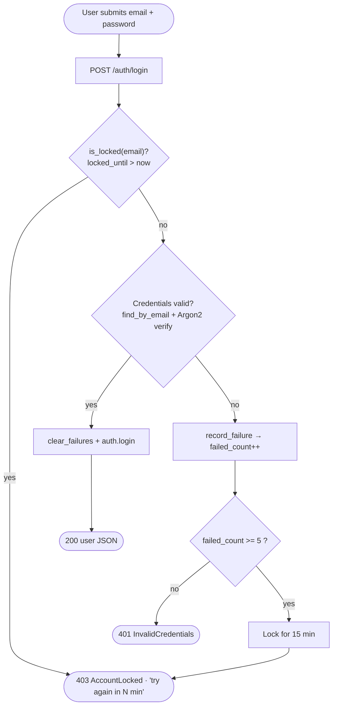
```mermaid
flowchart TD
    A([User submits email + password]) --> B["POST /auth/login"]
    B --> C{"is_locked(email)?<br/>locked_until > now"}
    C -- yes --> D([403 AccountLocked · 'try again in N min'])
    C -- no --> E{"Credentials valid?<br/>find_by_email + Argon2 verify"}
    E -- no --> F["record_failure → failed_count++"]
    F --> G{"failed_count >= 5 ?"}
    G -- yes --> H["Lock for 15 min"] --> D
    G -- no --> I([401 InvalidCredentials])
    E -- yes --> J["clear_failures + auth.login"]
    J --> K([200 user JSON])
```

### 1.3 Login lockout state machine
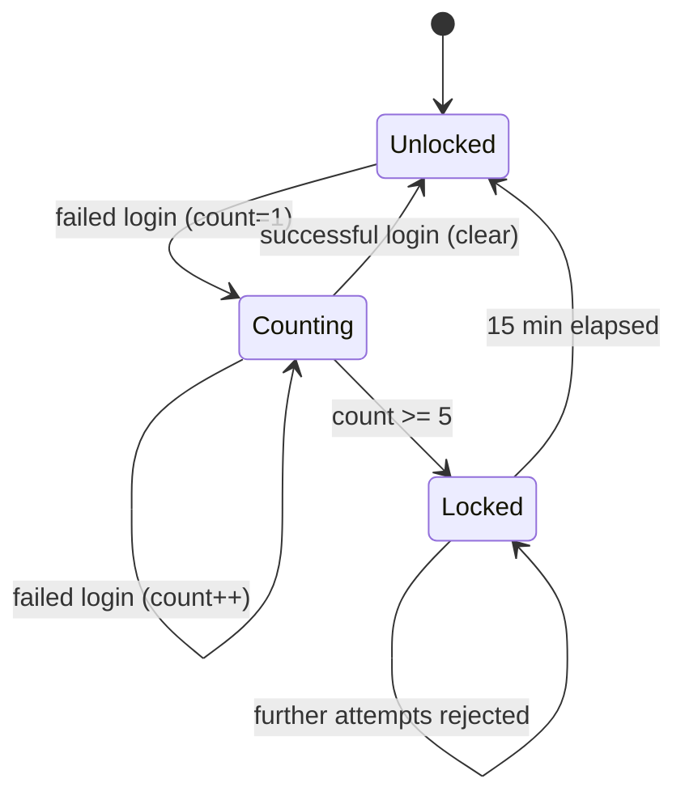
```mermaid
stateDiagram-v2
    [*] --> Unlocked
    Unlocked --> Counting : failed login (count=1)
    Counting --> Counting : failed login (count++)
    Counting --> Locked : count >= 5
    Locked --> Locked : further attempts rejected
    Locked --> Unlocked : 15 min elapsed
    Counting --> Unlocked : successful login (clear)
```

### 1.4 OAuth (GitHub / Google) — session fix
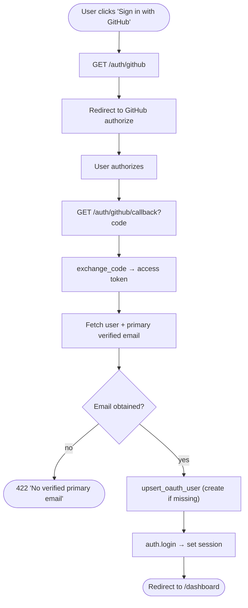
```mermaid
flowchart TD
    A([User clicks 'Sign in with GitHub']) --> B["GET /auth/github"]
    B --> C[Redirect to GitHub authorize]
    C --> D[User authorizes]
    D --> E["GET /auth/github/callback?code"]
    E --> F["exchange_code → access token"]
    F --> G["Fetch user + primary verified email"]
    G --> H{"Email obtained?"}
    H -- no --> I([422 'No verified primary email'])
    H -- yes --> J["upsert_oauth_user (create if missing)"]
    J --> K["auth.login → set session"]
    K --> L([Redirect to /dashboard])
```

### 1.5 Logout / Me
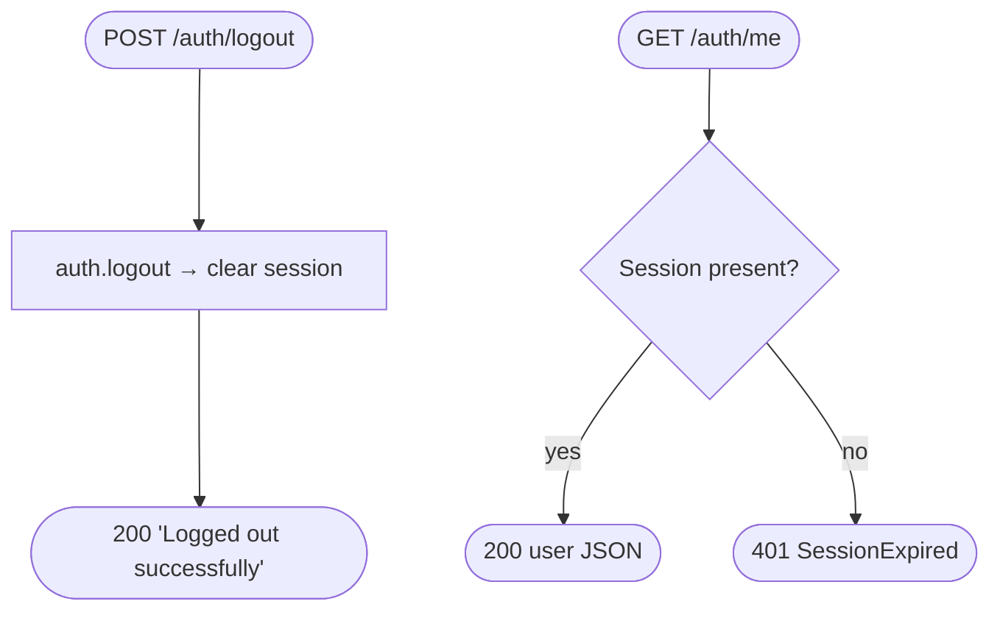
```mermaid
flowchart TD
    A(["POST /auth/logout"]) --> B["auth.logout → clear session"]
    B --> C([200 'Logged out successfully'])
    D(["GET /auth/me"]) --> E{"Session present?"}
    E -- yes --> F([200 user JSON])
    E -- no --> G([401 SessionExpired])
```

## 2. Onboarding & Recommendation

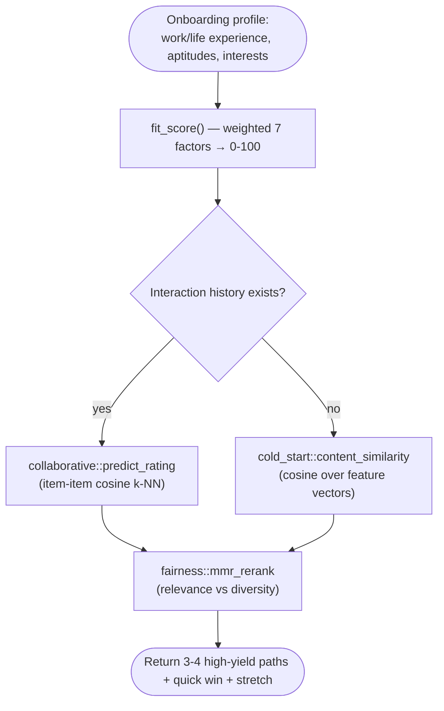
```mermaid
flowchart TD
    A([Onboarding profile:<br/>work/life experience, aptitudes, interests]) --> B["fit_score() — weighted 7 factors → 0-100"]
    B --> C{"Interaction history exists?"}
    C -- yes --> D["collaborative::predict_rating<br/>(item-item cosine k-NN)"]
    C -- no --> E["cold_start::content_similarity<br/>(cosine over feature vectors)"]
    D --> F["fairness::mmr_rerank<br/>(relevance vs diversity)"]
    E --> F
    F --> G([Return 3-4 high-yield paths + quick win + stretch])
```

## 3. Learning loop (BKT + SM-2)

### 3.1 Exercise → mastery (BKT)
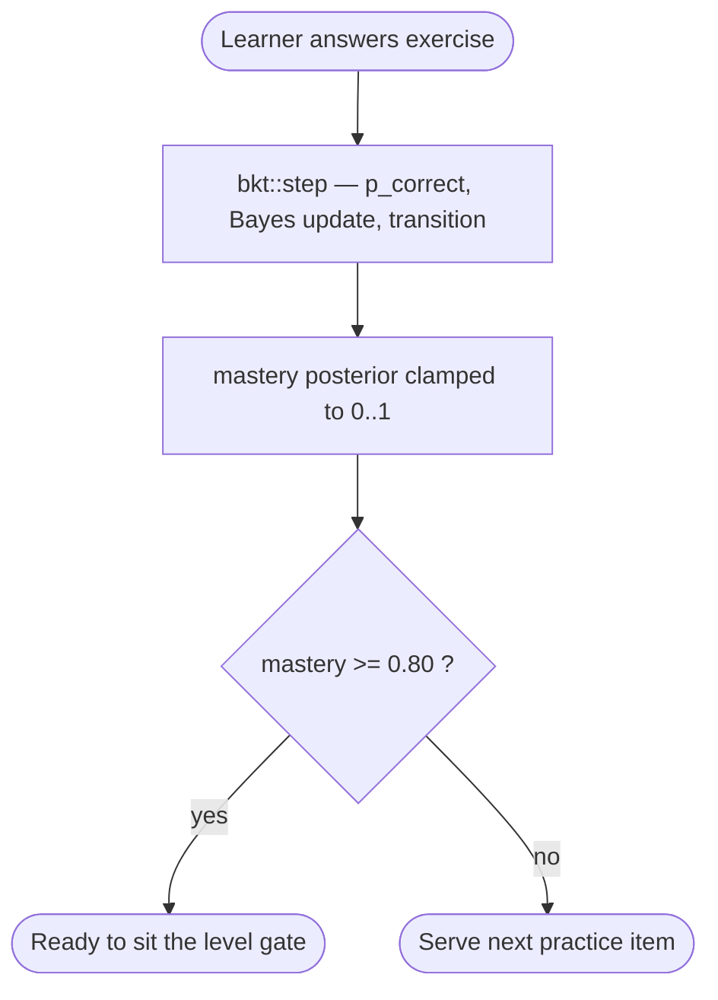
```mermaid
flowchart TD
    A([Learner answers exercise]) --> B["bkt::step — p_correct, Bayes update, transition"]
    B --> C["mastery posterior clamped to 0..1"]
    C --> D{"mastery >= 0.80 ?"}
    D -- yes --> E([Ready to sit the level gate])
    D -- no --> F([Serve next practice item])
```

### 3.2 Spaced repetition (SM-2)
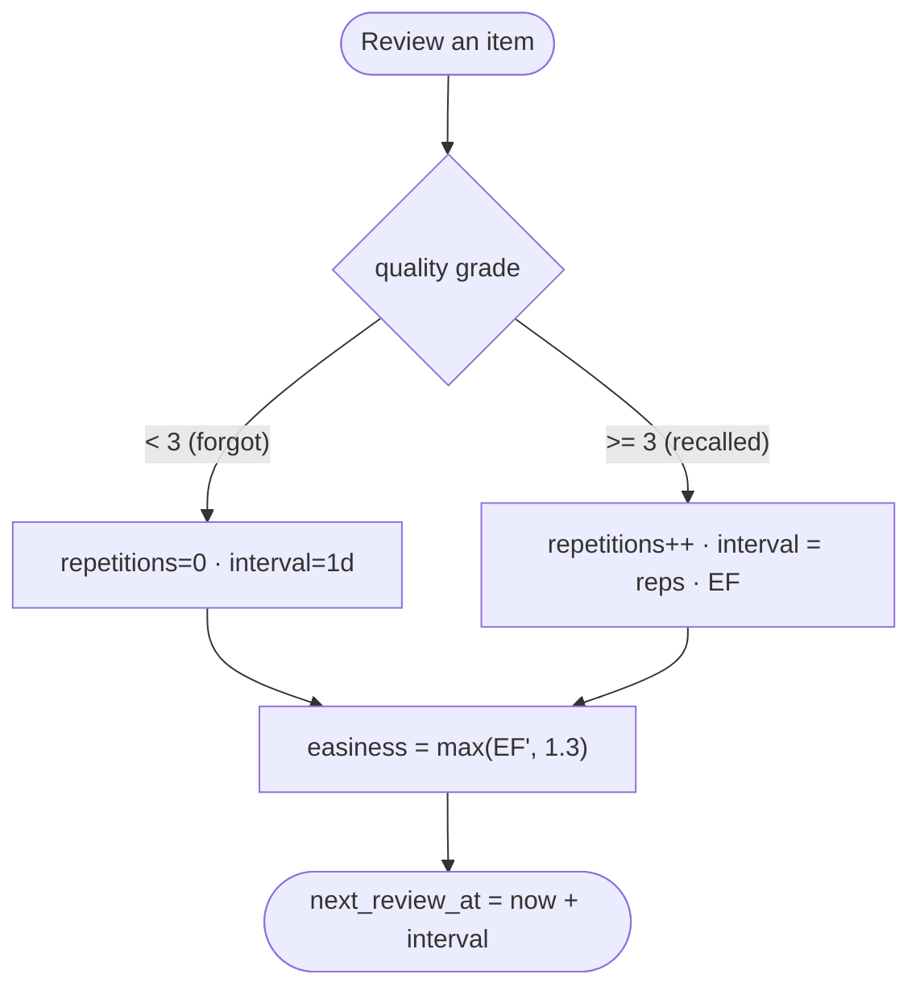
```mermaid
flowchart TD
    A([Review an item]) --> B{"quality grade"}
    B -- "< 3 (forgot)" --> C["repetitions=0 · interval=1d"]
    B -- ">= 3 (recalled)" --> D["repetitions++ · interval = reps · EF"]
    C --> E["easiness = max(EF', 1.3)"]
    D --> E
    E --> F([next_review_at = now + interval])
```

### 3.3 Skill-mastery lifecycle state machine
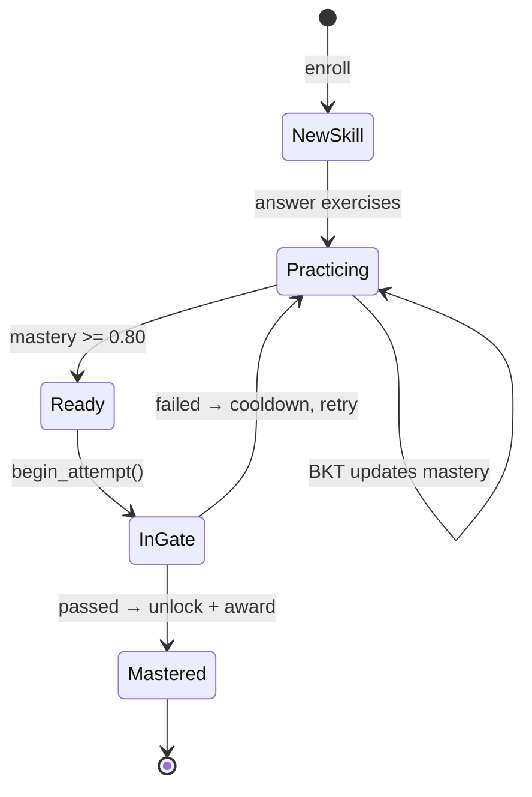
```mermaid
stateDiagram-v2
    [*] --> NewSkill : enroll
    NewSkill --> Practicing : answer exercises
    Practicing --> Practicing : BKT updates mastery
    Practicing --> Ready : mastery >= 0.80
    Ready --> InGate : begin_attempt()
    InGate --> Mastered : passed → unlock + award
    InGate --> Practicing : failed → cooldown, retry
    Mastered --> [*]
```

## 4. Level Gate (assessment saga)

### 4.1 Gate state machine
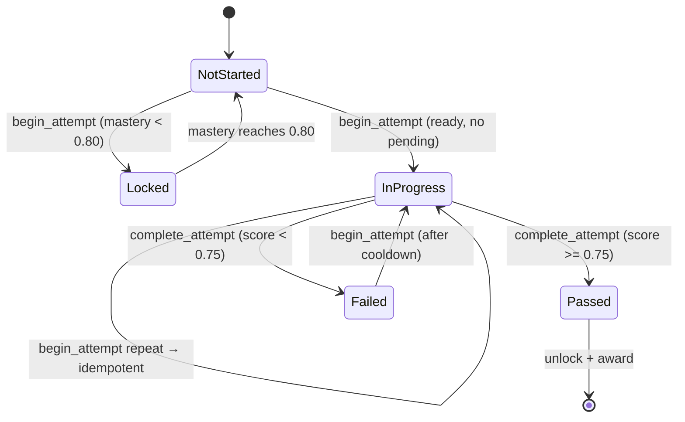
```mermaid
stateDiagram-v2
    [*] --> NotStarted
    NotStarted --> Locked : begin_attempt (mastery < 0.80)
    Locked --> NotStarted : mastery reaches 0.80
    NotStarted --> InProgress : begin_attempt (ready, no pending)
    InProgress --> InProgress : begin_attempt repeat → idempotent
    InProgress --> Passed : complete_attempt (score >= 0.75)
    InProgress --> Failed : complete_attempt (score < 0.75)
    Failed --> InProgress : begin_attempt (after cooldown)
    Passed --> [*] : unlock + award
```

### 4.2 begin_attempt
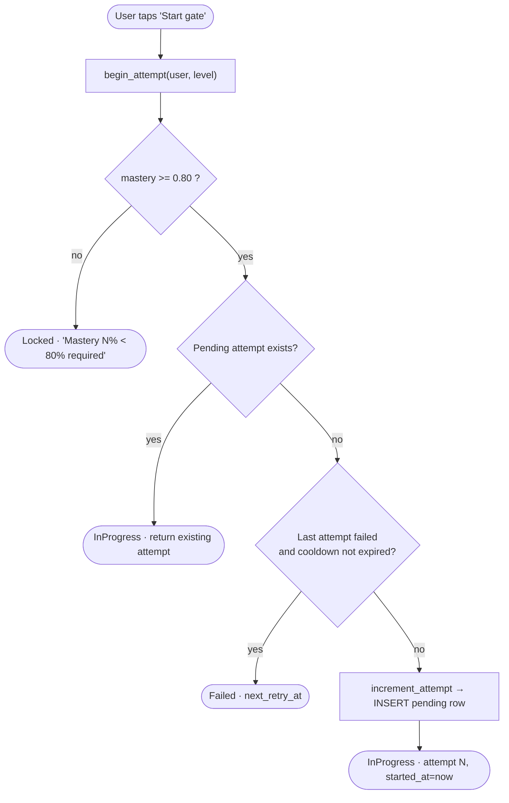
```mermaid
flowchart TD
    A([User taps 'Start gate']) --> B["begin_attempt(user, level)"]
    B --> C{"mastery >= 0.80 ?"}
    C -- no --> D(["Locked · 'Mastery N% < 80% required'"])
    C -- yes --> E{"Pending attempt exists?"}
    E -- yes --> F([InProgress · return existing attempt])
    E -- no --> G{"Last attempt failed<br/>and cooldown not expired?"}
    G -- yes --> H([Failed · next_retry_at])
    G -- no --> I["increment_attempt → INSERT pending row"]
    I --> J([InProgress · attempt N, started_at=now])
```

### 4.3 complete_attempt → award pipeline
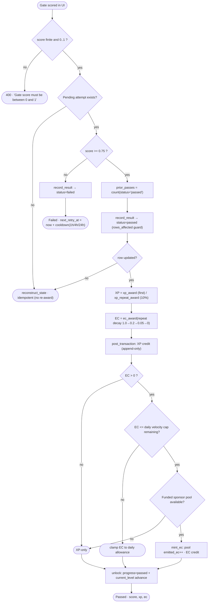
```mermaid
flowchart TD
    A([Gate scored in UI]) --> B{"score finite and 0..1 ?"}
    B -- no --> C(["400 · 'Gate score must be between 0 and 1'"])
    B -- yes --> D{"Pending attempt exists?"}
    D -- no --> E(["reconstruct_state · idempotent (no re-award)"])
    D -- yes --> F{"score >= 0.75 ?"}
    F -- no --> G["record_result → status=failed"]
    G --> H(["Failed · next_retry_at = now + cooldown(1h/4h/24h)"])
    F -- yes --> I["prior_passes = count(status='passed')"]
    I --> J["record_result → status=passed (rows_affected guard)"]
    J --> K{"row updated?"}
    K -- no --> E
    K -- yes --> L["XP = xp_award (first) / xp_repeat_award (10%)"]
    L --> M["EC = ec_award(repeat decay 1.0→0.2→0.05→0)"]
    M --> N["post_transaction: XP credit (append-only)"]
    N --> O{"EC > 0 ?"}
    O -- no --> S(["XP-only"])
    O -- yes --> P{"EC <= daily velocity cap remaining?"}
    P -- no --> R(["clamp EC to daily allowance"])
    P -- yes --> Q{"Funded sponsor pool available?"}
    Q -- no --> S
    Q -- yes --> T["mint_ec: pool emitted_ec++ · EC credit"]
    R --> U["unlock: progress=passed + current_level advance"]
    S --> U
    T --> U
    U --> V([Passed · score, xp, ec])
```

## 5. Economy Ledger

### 5.1 post_transaction (double-entry engine)
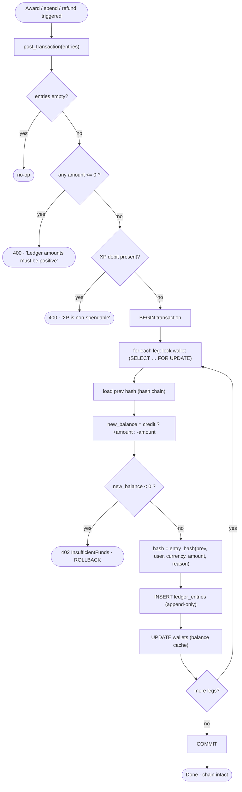
```mermaid
flowchart TD
    A([Award / spend / refund triggered]) --> B["post_transaction(entries)"]
    B --> C{"entries empty?"}
    C -- yes --> D([no-op])
    C -- no --> E{"any amount <= 0 ?"}
    E -- yes --> F(["400 · 'Ledger amounts must be positive'"])
    E -- no --> G{"XP debit present?"}
    G -- yes --> H(["400 · 'XP is non-spendable'"])
    G -- no --> I["BEGIN transaction"]
    I --> J["for each leg: lock wallet (SELECT … FOR UPDATE)"]
    J --> K["load prev hash (hash chain)"]
    K --> L["new_balance = credit ? +amount : -amount"]
    L --> M{"new_balance < 0 ?"}
    M -- yes --> N(["402 InsufficientFunds · ROLLBACK"])
    M -- no --> O["hash = entry_hash(prev, user, currency, amount, reason)"]
    O --> P["INSERT ledger_entries (append-only)"]
    P --> Q["UPDATE wallets (balance cache)"]
    Q --> R{"more legs?"}
    R -- yes --> J
    R -- no --> S["COMMIT"]
    S --> T([Done · chain intact])
```

### 5.2 Daily reconciliation
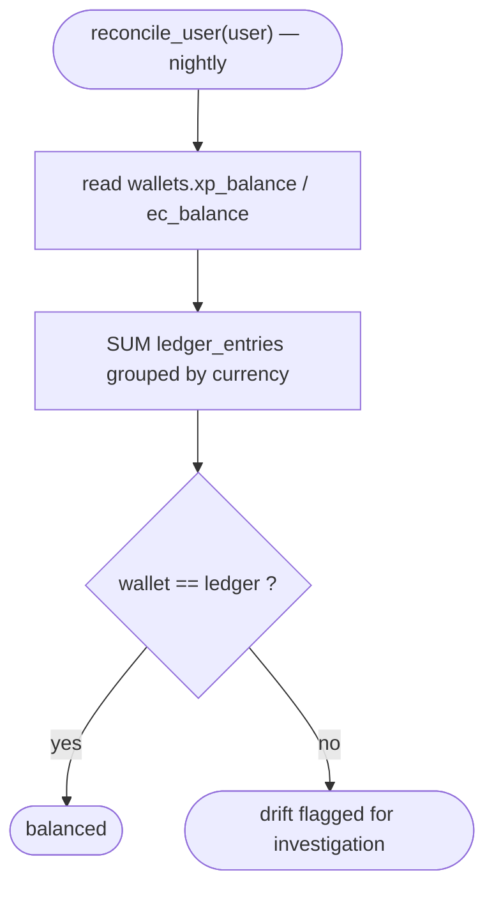
```mermaid
flowchart TD
    A(["reconcile_user(user) — nightly"]) --> B["read wallets.xp_balance / ec_balance"]
    B --> C["SUM ledger_entries grouped by currency"]
    C --> D{"wallet == ledger ?"}
    D -- yes --> E([balanced])
    D -- no --> F([drift flagged for investigation])
```

### 5.3 EC award lifecycle state machine
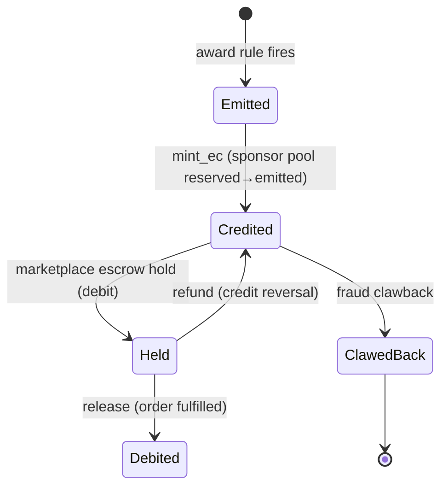
```mermaid
stateDiagram-v2
    [*] --> Emitted : award rule fires
    Emitted --> Credited : mint_ec (sponsor pool reserved→emitted)
    Credited --> Held : marketplace escrow hold (debit)
    Held --> Debited : release (order fulfilled)
    Held --> Credited : refund (credit reversal)
    Credited --> ClawedBack : fraud clawback
    ClawedBack --> [*]
```

## 6. Marketplace

### 6.1 Order placement (atomic stock + balance)
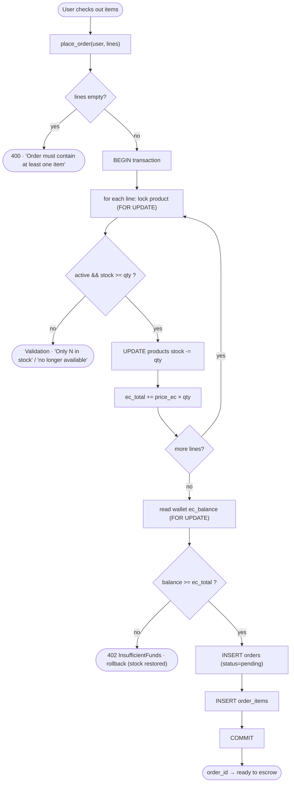
```mermaid
flowchart TD
    A([User checks out items]) --> B["place_order(user, lines)"]
    B --> C{"lines empty?"}
    C -- yes --> D(["400 · 'Order must contain at least one item'"])
    C -- no --> I["BEGIN transaction"]
    I --> J["for each line: lock product (FOR UPDATE)"]
    J --> K{"active && stock >= qty ?"}
    K -- no --> L(["Validation · 'Only N in stock' / 'no longer available'"])
    K -- yes --> M["UPDATE products stock -= qty"]
    M --> N["ec_total += price_ec × qty"]
    N --> O{"more lines?"}
    O -- yes --> J
    O -- no --> P["read wallet ec_balance (FOR UPDATE)"]
    P --> Q{"balance >= ec_total ?"}
    Q -- no --> R(["402 InsufficientFunds · rollback (stock restored)"])
    Q -- yes --> S["INSERT orders (status=pending)"]
    S --> T["INSERT order_items"]
    T --> U["COMMIT"]
    U --> V([order_id → ready to escrow])
```

### 6.2 Escrow hold / release / refund
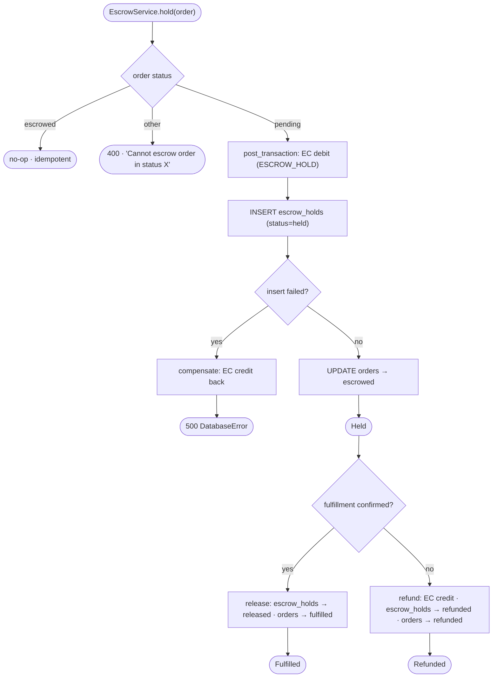
```mermaid
flowchart TD
    A(["EscrowService.hold(order)"]) --> B{"order status"}
    B -- escrowed --> C([no-op · idempotent])
    B -- other --> K(["400 · 'Cannot escrow order in status X'"])
    B -- pending --> D["post_transaction: EC debit (ESCROW_HOLD)"]
    D --> E["INSERT escrow_holds (status=held)"]
    E --> F{"insert failed?"}
    F -- yes --> G["compensate: EC credit back"] --> H(["500 DatabaseError"])
    F -- no --> I["UPDATE orders → escrowed"]
    I --> J([Held])

    J --> L{"fulfillment confirmed?"}
    L -- yes --> M["release: escrow_holds → released · orders → fulfilled"]
    M --> N([Fulfilled])
    L -- no --> O["refund: EC credit · escrow_holds → refunded · orders → refunded"]
    O --> P([Refunded])
```

### 6.3 Order lifecycle state machine
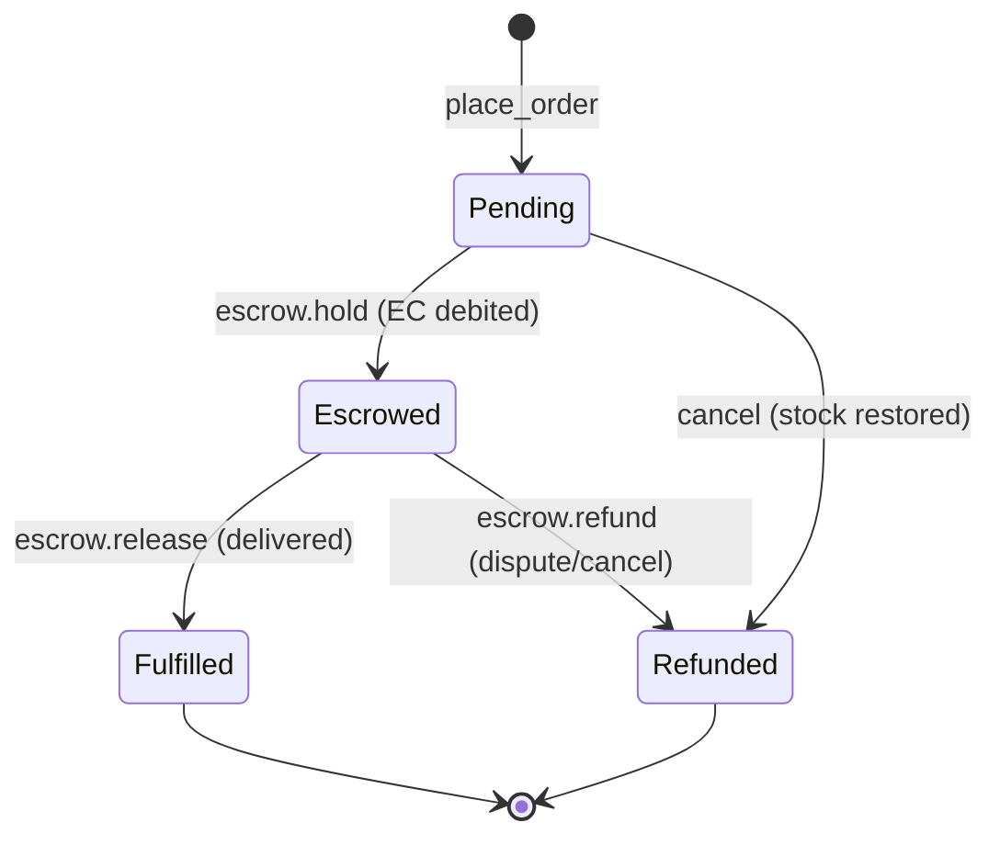
```mermaid
stateDiagram-v2
    [*] --> Pending : place_order
    Pending --> Escrowed : escrow.hold (EC debited)
    Escrowed --> Fulfilled : escrow.release (delivered)
    Escrowed --> Refunded : escrow.refund (dispute/cancel)
    Pending --> Refunded : cancel (stock restored)
    Fulfilled --> [*]
    Refunded --> [*]
```

### 6.4 Dispute
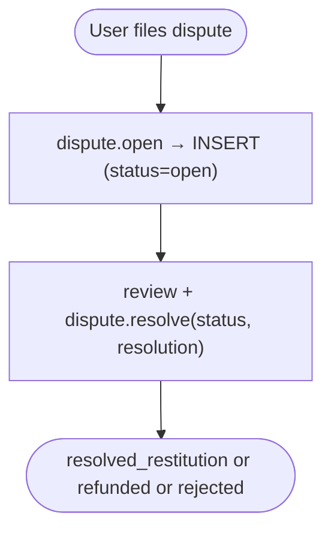
```mermaid
flowchart TD
    A([User files dispute]) --> B["dispute.open → INSERT (status=open)"]
    B --> C["review + dispute.resolve(status, resolution)"]
    C --> D([resolved_restitution or refunded or rejected])
```

## 7. Notifications

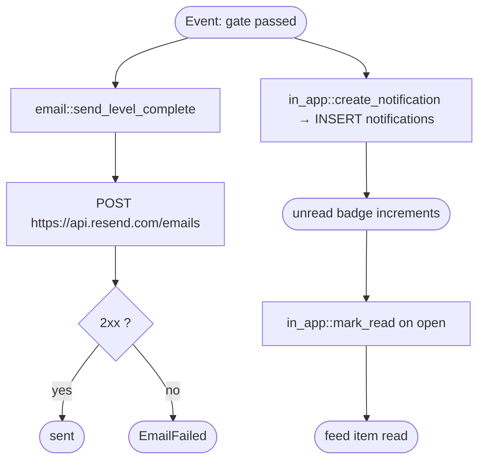
```mermaid
flowchart TD
    A([Event: gate passed]) --> B["email::send_level_complete"]
    B --> C["POST https://api.resend.com/emails"]
    C --> D{"2xx ?"}
    D -- yes --> E([sent])
    D -- no --> F(["EmailFailed"])

    A --> G["in_app::create_notification → INSERT notifications"]
    G --> H([unread badge increments])
    H --> I["in_app::mark_read on open"]
    I --> J([feed item read])
```

## 8. Social

### 8.1 Guild create / join
```mermaid
flowchart TD
    A([User taps 'Create guild']) --> B["social::guild::create(founder, name)"]
    B --> C{"founder_level >= 10 ?"}
    C -- no --> D(["Validation · 'Reach level 10 before founding a guild'"])
    C -- yes --> E["INSERT guilds"]
    E --> F["INSERT guild_members (role=founder)"]
    F --> G([guild_id])

    H([User taps 'Join guild']) --> I["social::guild::join(guild, user)"]
    I --> J{"has_capacity (members < 50) ?"}
    J -- no --> K(["Validation · 'This guild is full'"])
    J -- yes --> L["INSERT guild_members (member) ON CONFLICT DO NOTHING"]
    L --> M([joined])
```

### 8.2 League / leaderboard
```mermaid
flowchart TD
    A([Season clock]) --> B["league::season_number(now) = weeks / 12"]
    B --> C["league::leaderboard(pool, limit):<br/>users JOIN wallets ORDER BY xp_balance DESC"]
    C --> D([Top N learners by XP])
```

### 8.3 Reputation
```mermaid
flowchart TD
    A([Trust event: peer review / mentoring / bounty]) --> B["INSERT reputation_events (weight)"]
    B --> C["reputation_score: Σ weight × 0.5^(age_days/30)"]
    C --> D([time-decayed reputation])
```

## 9. AI Gateway (budget-gated)

```mermaid
flowchart TD
    A([User asks the AI tutor]) --> B["gateway.complete(user_id, task, system, prompt)"]
    B --> C["guardrails::scan → redact PII + detect injection"]
    C --> D{"injection suspected?"}
    D -- yes --> E(["400 · 'Prompt rejected by safety guardrail'"])
    D -- no --> F["cache key = hash(task, system, clean_prompt)"]
    F --> G{"semantic cache hit?"}
    G -- yes --> H([return cached])
    G -- no --> I{"global monthly token cap?"}
    I -- exceeded --> J(["503 AI_BUDGET_EXHAUSTED"])
    I -- ok --> K{"per-user daily token cap?"}
    K -- exceeded --> L(["429 AI_DAILY_BUDGET_EXHAUSTED"])
    K -- ok --> M["POST /v1/chat/completions (reqwest)"]
    M --> N{"HTTP success?"}
    N -- no --> O(["502 AiGateway(error)"])
    N -- yes --> P["record_usage (global + per-user)"]
    P --> Q["cache response (TTL 7d)"]
    Q --> R([explanation / answer])
```

## 10. Flow → code index (for traceability)

| Flow | Rust code |
|---|---|
| §1 Auth + lockout + OAuth | `crates/auth/{backend,password,oauth,lockout}.rs` · `services/api/src/routes/auth.rs` |
| §2 Recommendation | `crates/recommendations/{fit_score,cold_start,collaborative,fairness}.rs` |
| §3 Learning | `crates/learning/{bkt,sm2,difficulty,progress}.rs` |
| §4 Gate + award | `crates/assessment/{gate_saga,irt,rubric}.rs` · `crates/learning/gate.rs` · `crates/economy/{xp,ec}.rs` |
| §5 Ledger | `crates/economy/{ledger,hash_chain,reconcile}.rs` |
| §6 Marketplace | `crates/marketplace/{order,escrow,dispute,settlement}.rs` |
| §7 Notifications | `crates/notifications/{email,in_app,push}.rs` |
| §8 Social | `crates/social/{guild,league,reputation,moderation}.rs` |
| §9 AI | `crates/ai/{gateway,guardrails,cache,embeddings,rag,prompts}.rs` · `services/genai/src/routes/generate.rs` |

> Related: [16-rust-implementation.md](16-rust-implementation.md) (module map) · [SETUP.md](../SETUP.md) (run/deploy) · [16-data-flows.md](16-data-flows.md) (this file).